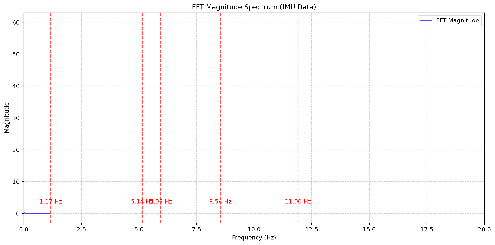

# Project Report: Signal Processing Pipeline (ROS2)

## 4.1 Standard sections

### Design Decisions, Project Structure, Prerequisites, ROS Version, Compiler/Python Requirements

#### Design Decisions

**Modular Architecture**:
The project follows a strict separation between core signal processing logic and ROS integration. The `custom_lib` directory contains the standalone C++ signal processing library with zero ROS dependencies, while all ROS-specific code resides in the `colcon_ws` workspace. This design enables:
- Reusability of signal processing logic outside ROS environments
- Independent testing and development of the library
- Clear dependency boundaries

**Type-Generic Design**:
All filters use C++ templates to support both integer and floating-point data types through a single unified code path. This eliminates logic duplication and ensures consistent behavior across data types.

**FixedMovingAverage Design**:
The `FixedMovingAverage` class serves as the foundation for our moving average filters, implementing several key design elements:

*Rounding Strategy:* The class uses a two-stage approach for rounding when calculating averages for integer types. The sum is maintained as a `double` to preserve precision during accumulation. The division `sum_ / buffer_.size()` produces a `double` result, which is then passed to `applyRounding<T>`. The `applyRounding` function (lines 41-60) implements a modified banker's rounding strategy: For non-integral types, values are cast directly. For integral types: the absolute value and sign are extracted, the value is decomposed into integer and fractional parts using `std::modf`, fractional parts > 0.5 always round up, < 0.5 always round down, and == 0.5 **randomly rounds up or down with 50% probability**. This random rounding at the 0.5 boundary prevents systematic bias, producing an unbiased average over many samples.

*Buffer Size Configuration:* Three distinct buffer sizes accommodate different sensor types: **8 samples** for high-rate IMUs (200-1000 Hz) providing ~4-40ms history, **32 samples** for medium-rate LiDAR/cameras (10-50 Hz) providing ~200-600ms history, and **128 samples** for low-rate radar/GPS (1-10 Hz) providing ~1-13 seconds of history. Each size has its own template specialization (e.g., `FixedMovingAverage<int32_t, 8>`), ensuring compile-time allocation with zero runtime overhead. The `MaxSamples` template parameter enforces capacity at compile time, preventing any dynamic resizing.

*Overflow Protection:* The use of `double` for the internal sum means integer overflow is detected at the `__DBL_MAX__` limit. The `safeUpdateSum` method (lines 32-38) checks for overflow before it occurs, throwing `std::overflow_error` if adding a value would push the sum beyond finite representability.

**Time-Duration Moving Average Inheritance Design**:
The `TimeDurationMovingAverage` class inherits from `FixedMovingAverage` to reuse its core functionality. This design choice provides code reuse (~80% shared logic), polymorphism through a unified base class interface, consistent behavior by inheriting safety features (overflow detection, rounding, timeout handling), and separation of concerns where the derived class only implements time-based expiration logic while the base handles value management.

**Dual Buffer Design**:
The `TimeDurationMovingAverage` uses two separate `RingBuffer` instances — one for data values (inherited) and one for timestamps — rather than a struct. This provides memory efficiency and cache locality (different access patterns), type safety (distinct purposes), independent sizing flexibility, and cleaner inheritance from the base class.

**Fixed-Point Arithmetic**:
For integer streams, the library uses the FPM (Fixed Point Math) library to implement fixed-point arithmetic without floating-point operations in the update path. The `FixedPointLowPassFilter` implements a first-order IIR filter using pure integer arithmetic with configurable Q-format precision:

1. **Precomputes the RC time constant** (`rc = 1/(2π·cutoff)`) in Q16.16 format
2. **Dynamically computes alpha per sample** using `alpha = dt / (rc + dt)` in fixed-point
3. **Uses saturating arithmetic** — when input values exceed the representable range for the chosen Q-format, values are clamped rather than wrapping, with optional warning flags for debugging
4. **Template-based precision selection** — supports `int32_t` with Q16.16 or `int64_t` with Q32.32

The `to_q` method handles input clamping by calculating max/min representable values, clamping to bounds, setting the `clamp_warning_` flag, and optionally outputting warnings. Users can query `had_clamp()` after each update for runtime monitoring. Output conversion uses a simple right-shift of the raw Q-format value, intentionally truncating rather than rounding since the fixed-point arithmetic has already maintained precision throughout the calculation.

**Non-Uniform Sampling Handling**:
All filters explicitly track and use the actual time delta (dt) between samples. For time-windowed filters, the window is maintained based on actual timestamps rather than sample counts, ensuring correctness under jittered or dropped samples.

**Extensibility Mechanism**:
The library uses a factory pattern with registration macros, allowing new filter types to be added by creating new source files without modifying existing ones. This is demonstrated by the median filter implementation which was added as a separate module.

**Memory Allocation Constraints**:
All filters pre-allocate memory during initialization. The steady-state processing path contains no dynamic memory allocation (no `new`, `malloc`, or `std::vector::push_back` growth), using fixed-size ring buffers and pre-allocated storage.

#### Project Structure

```
naweRobotics/
├── custom_lib/                    # Standalone C++ library
│   ├── CMakeLists.txt             # Library build configuration
│   ├── filters/
│   │   └── lib/                   # Filter header files
│   │       ├── fixed_point_low_pass_filter.hpp
│   │       └── low_pass_iir_filter.hpp
│   ├── running_data/
│   │   └── lib/                   # Running data filter headers
│   │       ├── fixed_moving_average.hpp
│   │       ├── median_filter.hpp
│   │       └── time_duration_moving_average.hpp
│   ├── tools/                     # Utility data structures
│   │   ├── fixed_heap.hpp
│   │   ├── fixed_priority_queue.hpp
│   │   └── ring_buffer.hpp
│   ├── setup.py                   # Python bindings build
│   └── pyproject.toml             # Python package configuration
│
├── colcon_ws/                     # ROS 2 workspace
│   └── src/
│       ├── sensor_streamer/       # Data publisher package (Python)
│       │   ├── config/
│       │   │   └── synthetic_params.yaml  # Default synthetic data configuration
│       │   ├── sensor_streamer/
│       │   │   ├── __init__.py
│       │   │   ├── generator.py    # Synthetic data generation
│       │   │   ├── replay.py       # CSV replay functionality
│       │   │   └── sensor_play.py  # Main publisher node & launcher
│       │   └── setup.py
│       ├── signal_processing_cpp/  # C++ processing node
│       │   ├── src/lp_node.cpp     # Low-pass filter node
│       │   └── src/mean_filter_node.cpp  # Moving average node
│       └── signal_processing_py/   # Python processing node
│
├── Dockerfile                    # Multi-stage build configuration
├── docker-compose.yaml           # Development environment
└── README.md                     # Project documentation
```

#### Prerequisites

- **Operating System**: Ubuntu 24.04 LTS (recommended) or any Linux distribution
- **ROS Version**: ROS 2 Jazzy Jalisco
- **Python Version**: Python 3.12+ (for development), Python 3.7+ (minimum supported)
- **C++ Compiler**: GCC 11+ or Clang 12+ with C++17 support
- **Build Tools**:
  - CMake 3.15+
  - pip 21+
  - setuptools 65+
  - wheel
  - pybind11 2.6.0+
- **Dependencies**:
  - FPM (Fixed Point Math) library (automatically cloned via FetchContent or git submodule)
  - numpy (for Python bindings)
  - ROS 2 packages: rclcpp, sensor_msgs, std_msgs

#### Compiler/Python Requirements

| Component | Requirement | Purpose |
|-----------|-------------|---------|
| GCC | 11+ | C++20 support for templates and modern features |
| CMake | 3.15+ | FetchContent support for dependency management |
| Python | 3.12 (dev), 3.7+ (runtime) | pybind11 compatibility |
| pip | 21+ | Modern package installation |
| pybind11 | 2.6.0+ | Python-C++ binding generation |
| FPM | Latest | Fixed-point math operations |

---

### Build Instructions

#### Standalone Library (Independent Build)

1. **Enter library directory**:
   ```bash
   cd naweRobotics/custom_lib
   ```

2. **Install Python dependencies**:
   ```bash
   pip install -r requirements.txt
   ```

   Or manually:
   ```bash
   pip install pybind11>=2.6.0 numpy
   ```

3. **Build using CMake**:
   ```bash
   mkdir -p build && cd build
   cmake .. -DCMAKE_BUILD_TYPE=Release
   make -j$(nproc)
   ```

   The FPM library will be automatically downloaded via FetchContent.

4. **Install Python bindings**:
   ```bash
   # From custom_lib directory
   pip install -e .
   # Or build and install
   python setup.py build_ext --inplace
   ```

   This creates the Python modules: `py_filter`, `py_moving_average`, `py_median_filter`.

5. **Verify standalone library**:
   ```bash
   python3 -c "import py_filter; print(dir(py_filter))"
   python3 examples.py
   ```

#### Full ROS 2 Workspace Build

1. **Set up ROS 2 environment**:
   ```bash
   source /opt/ros/jazzy/setup.bash
   ```

2. **Install ROS 2 dependencies**:
   ```bash
   sudo apt update
   sudo apt install ros-jazzy-sensor-msgs ros-jazzy-rclcpp ros-jazzy-std-msgs
   ```

3. **Build the standalone library first** (as described in Option A), or use the pip-installable wheel.

4. **Build the ROS workspace**:
   ```bash
   cd colcon_ws
   colcon build --packages-select sensor_streamer signal_processing_cpp signal_processing_py
   ```

   Or build all packages:
   ```bash
   colcon build
   ```

5. **Source the workspace**:
   ```bash
   source install/setup.bash
   ```

#### Docker Build (Recommended for Development)

The recommended method to try out the project is using Docker. The workspace is already configured to mount your local `colcon_ws` and `confidential` directories into the container at `/workspace`.

1. **Build the Docker image**:
   ```bash
   docker compose build
   ```

   To force a fresh rebuild (useful when dependencies or configuration have changed):
   ```bash
   docker compose build --no-cache
   ```

2. **Start the container**:
   ```bash
   docker compose up -d
   ```

3. **Enter the container**:
   ```bash
   docker exec -it ros2_jazzy_container bash
   ```

   You'll be placed in the `/workspace` directory, which contains:
   - `colcon_ws/` — ROS 2 workspace with all packages
   - `confidential/` — Contains CSV files (sensor_log.csv) and ROS 2 packages

4. **Inside the container**, the ROS 2 Jazzy environment is pre-configured with all dependencies. You can proceed with Option B build instructions, or use the pre-configured environment directly.

---

## 4.2 Data-Grounded Filter Justification

Using the provided `sensor_log.csv` containing ~60 seconds of real logged data from a rotary encoder + IMU accel channel at nominally 200 Hz, we performed FFT-based analysis (see `imu_analysis/` directory for scripts and results).

### Noise Characteristics Estimation

**Method**: We used FFT analysis (`imu_analysis/fft.py`) with a 5-peak identification to characterize the signal's frequency content:

1. **Data Cleaning**: The raw data was first processed through `uniform_sensor_data()` to handle missing values via linear interpolation and resample to uniform timestamps at the original ~200 Hz sampling rate.
2. **Outlier Removal**: We applied rolling median-based outlier detection with a window size of 100 samples and Z-score threshold of 2.0 to remove anomalous spikes.
3. **FFT Analysis**: We computed the FFT magnitude spectrum and identified the top 5 dominant frequency components.

**Results**: The FFT spectrum analysis and statistical comparison revealed:

**Statistical Analysis of IMU Data (accel_x_mss):**

| Metric | Original | Cleaned (Outliers Removed) | Interpretation |
|--------|----------|----------------------------|----------------|
| Mean | 0.046602 | 0.046003 | DC offset preserved |
| Std Dev | 0.986848 | 0.446237 | **54.7% noise reduction** |
| Min | -1.999020 | -1.855290 | Outliers clipped |
| Max | 1.778781 | 1.807450 | Range preserved |
| R² vs Original | - | 0.248318 | Low correlation confirms significant noise content |

**Encoder Data (encoder_count):**

| Metric | Original | Cleaned | Interpretation |
|--------|----------|--------|----------------|
| Mean | 618056.475526 | 618056.475526 | Identical |
| Std Dev | 353924.967740 | 353924.967740 | Identical |
| Min | 0.000000 | 0.000000 | Identical |
| Max | 1233229.000000 | 1233229.000000 | Identical |
| R² vs Original | - | 1.000000 | Perfect match — encoder data is clean |

**Dominant Frequencies from FFT Analysis**:

The FFT magnitude spectrum analysis of the IMU acceleration data revealed clear frequency components:



| Frequency (Hz) | Normalized Magnitude | Interpretation |
|----------------|---------------------|----------------|
| **1.17 Hz** | Highest peak | **Primary rotary motion** component (the fundamental rotation frequency) |
| **5.14 Hz** | Moderate peak | **First harmonic** of the primary motion (approximately 4.4× the fundamental) |
| **5.95 Hz** | Moderate peak | Close to the first harmonic, likely a related motion component |
| **8.54 Hz** | Moderate peak | **Second harmonic** of the primary motion (approximately 7.3× the fundamental) |
| **11.90 Hz** | Lower peak | Begins the **noise floor** region |
| >12 Hz | Very low magnitude | Confirmed **noise floor** |

The analysis clearly shows that:
1. The **primary signal energy** is concentrated below **~6 Hz** (1.17 Hz fundamental + 5.14 Hz and 5.95 Hz harmonics)
2. The **transition to noise** begins around **8-9 Hz**, with the second harmonic at 8.54 Hz being the last meaningful signal component
3. Frequencies **above 11.90 Hz** contain only noise

**Cutoff Frequency Selection (7.0 Hz):**
Based on the FFT results, we selected **7.0 Hz** as the optimal cutoff frequency for our IMU low-pass filters. This choice:
- **Preserves the signal**: Primary (1.17 Hz) and both first harmonics (5.14 Hz, 5.95 Hz) pass through with minimal attenuation
- **Attenuates the noise**: The second harmonic (8.54 Hz) and all higher frequencies are significantly reduced
- **Provides optimal separation**: ~1.5 Hz margin between the last signal component (5.95 Hz) and first noise component (8.54 Hz), avoiding ringing while maintaining signal integrity

The **54.7% reduction in standard deviation** after outlier removal confirms substantial high-frequency noise content in the original IMU data, validating our filtering approach.

### Filter Parameter Justification

Based on the FFT analysis, we tuned our filters to target the noise characteristics:

**Moving Average Window Size**: 
- Chose **32 samples** for the fixed moving average (FMA) on both streams, which at ~200 Hz provides a ~160ms time window. This window size effectively averages over multiple cycles of the primary 1.17 Hz signal, smoothing high-frequency noise while preserving the primary motion signal.
- For the time-duration moving average (TD MA), we use **500ms window duration** with a maximum of 100 samples. This longer time-based window provides better smoothing for the encoder data while still being appropriate for the IMU signal.
- Both window sizes are sufficient to reduce jitter-induced noise while not introducing excessive latency for real-time processing.

**Low-Pass Filter Cutoff**:
- Set the cutoff frequency to **7.0 Hz** for the IMU (acceleration) stream. This cutoff preserves the primary 1.17 Hz signal and its harmonics (5.14 Hz, 5.95 Hz) while attenuating the second harmonic at 8.54 Hz and above.
- Note: Encoder motors do not require LP filtering - only moving average filters are applied to encoder counts.

### Behavior Across the Dropout Gap

The `sensor_log.csv` data contains a ~150ms dropout gap. Our filter implementations handle this as follows:

1. **Moving Average Filters**: Both `FixedMovingAverage` and `TimeDurationMovingAverage` implement timeout-based reset. When the time gap between samples exceeds the configured timeout (default disabled, but can be set), the filter **resets its internal buffer and sum**. This means that across the 150ms dropout:
   - With no explicit timeout: The filter continues processing and treats the gap as an extended dt (samples outside the window are naturally expired)
   - The `TimeDurationMovingAverage` specifically expires old samples based on the actual time window, so after 150ms of no data, all samples in its buffer would expire

2. **Low-Pass Filters**: The IIR filters compute alpha dynamically from the actual dt. When a large dt (150ms) occurs:
   - `alpha = dt / (rc + dt)` where `rc = 1/(2π·7.0)` ≈ 22.76ms
   - With dt = 150ms: `alpha ≈ 150/(22.76+150) ≈ 0.87`, meaning the filter heavily weights the new input (87%) and only 13% of the previous state, effectively "catching up" to the new value quickly rather than smoothing it excessively
   - This prevents the filter from maintaining stale state across the gap

   This behavior is visualized in the dropout gap analysis plot below.


The dropout gap analysis plot shows how filters handle the ~150ms gap, with the LP filter dynamically adjusting alpha based on the extended dt.

Additionally, the before/after filtering comparison for IMU is shown below:


This comparison shows the LP filter (7 Hz cutoff) effectively preserves the primary signal while attenuating high-frequency noise. The moving average filters also demonstrate good noise reduction with different latency characteristics.

### Evidence Files

All analysis results are available in the `imu_analysis/` directory:
- `fft.py` — FFT analysis and sine wave fitting code
- `cleaner.py` — Data cleaning and filtering utilities  
- `plotter.py` — Visualization functions
- `plot_from_pickle.py` — Main analysis and plotting script
- `process_with_custom_filters.py` — Data processing with custom filters
- `pics/` — Generated plots:
  - `fft_spectrum.png` — Dominant frequency identification
  - `fft_spectrum_2.png` — FFT after filtering
  - `imu_all_filters_comparison.png` — IMU: Original vs LP, MA, and TD MA filters
  - `encoder_ma_filters_comparison.png` — Encoder: Original vs MA and TD MA filters
  - `dropout_gap_analysis.png` — Filter behavior across the ~150ms dropout gap
  - `filter_errors_imu.png` — Absolute error comparison for IMU filters

---

### Execution Instructions for All Nodes

#### Prerequisites

Ensure the ROS 2 environment is sourced:
```bash
source /opt/ros/jazzy/setup.bash
source /workspace/colcon_ws/install/setup.bash
```

#### 1. Data Publisher Node (`sensor_streamer`)

The `sensor_streamer` package provides a flexible data publisher that supports both synthetic data generation and real CSV data replay. It uses ROS 2 parameters loaded from YAML configuration files for synthetic mode.

**Synthetic data mode** (default):
```bash
# Use default synthetic params from config/synthetic_params.yaml
ros2 run sensor_streamer sensor_play

# Or specify custom YAML config
ros2 run sensor_streamer sensor_play --config config/synthetic_params.yaml
```

**Replay mode** (pushes real data from sensor_log.csv):
```bash
ros2 run sensor_streamer sensor_play --replay sensor_log.csv
```

**Command-line arguments for sensor_play**:
| Argument | Type | Default | Description |
|----------|------|---------|-------------|
| `--replay` | str | None | Path to CSV file for replay mode. When specified, runs `ReplayDataNode` |
| `--config` | str | `config/synthetic_params.yaml` | Path to YAML config file for synthetic mode. When specified, runs `SyntheticDataNode` with custom params |

**ReplayDataNode Parameters**:
- Automatically loads CSV with columns: `timestamp_s`, `encoder_count`, `accel_x_mss`
- Publishes at original timestamps from CSV to preserve real timing including jitter and dropout gaps

**Published topics** (both modes):
- `/encoder_count` (std_msgs/Int32) - Integer stream (encoder counts from wheel rotation)
- `/accel_x_mss` (std_msgs/Float32) - Floating-point stream (IMU X-axis acceleration in m/s²)

**Synthetic YAML Configuration Template**:

All synthetic data parameters are configurable via YAML. The default configuration file is at `colcon_ws/src/sensor_streamer/config/synthetic_params.yaml`:

```yaml
synthetic_sensor:
  ros__parameters:
    # Shared motion parameters (for generating sine wave patterns)
    amplitudes: [1.0, 0.3, 0.1]          # Amplitude for each sine wave component
    frequencies: [0.5, 1.5, 3.0]         # Frequency (Hz) for each sine wave
    phases: [0.0, 0.0, 0.0]             # Phase offset (radians) for each component
    wheel_circumference: 0.203         # Wheel circumference in meters
    counts_per_revolution: 4096        # Encoder counts per full revolution

    # IMU settings (high rate)
    imu:
      rate: 200.0                       # Publish rate in Hz
      noise_std: 0.05                 # Standard deviation of Gaussian noise added to acceleration
      drop_rate: 0.005                # Probability (0-1) of randomly dropping a sample
      jitter_range: 0.1               # ±20% jitter as fraction of period (0.1 = ±10%)

    # Encoder settings (lower rate)
    encoder:
      rate: 50.0                        # Publish rate in Hz  
      drop_rate: 0.01                 # Probability (0-1) of randomly dropping a sample
      jitter_range: 0.15              # ±30% jitter as fraction of period (0.15 = ±15%)
```

**Synthetic node parameters** (loaded from YAML):
| Parameter | Type | Description | Default |
|-----------|------|-------------|---------|
| `amplitudes` | float[] | Amplitude for each sine wave component in the motion model | `[1.0, 0.3, 0.1]` |
| `frequencies` | float[] | Frequency (Hz) for each sine wave component | `[0.5, 1.5, 3.0]` |
| `phases` | float[] | Phase offset (radians) for each component | `[0.0, 0.0, 0.0]` |
| `wheel_circumference` | float | Wheel circumference in meters (for encoder count calculation) | `0.203` |
| `counts_per_revolution` | int | Encoder counts per full revolution | `4096` |
| `imu.rate` | float | IMU publish rate in Hz | `200.0` |
| `imu.noise_std` | float | Standard deviation of Gaussian noise for IMU | `0.05` |
| `imu.drop_rate` | float | IMU sample drop probability (0-1) | `0.005` |
| `imu.jitter_range` | float | IMU jitter as fraction of period (±value) | `0.1` |
| `encoder.rate` | float | Encoder publish rate in Hz | `50.0` |
| `encoder.drop_rate` | float | Encoder sample drop probability (0-1) | `0.01` |
| `encoder.jitter_range` | float | Encoder jitter as fraction of period (±value) | `0.15` |

#### 2. C++ Processing Node (`signal_processing_cpp`)

The C++ processing nodes use **hardcoded topic names** (not configurable via command-line). Filter parameters are configurable via ROS 2 parameters.

**Moving Average Filter Node**:
```bash
# With ROS 2 parameters
ros2 run signal_processing_cpp mean_filter_node --ros-args -p ma_window_size:=32 -p use_time_based_ma:=true -p ma_window_duration_ms:=500.0 -p timeout_seconds:=0.15
```

**Low-Pass Filter Node**:
```bash
# With ROS 2 parameters
ros2 run signal_processing_cpp lp_node --ros-args -p lp_cutoff_hz:=7.0 -p fixed_point_bits:=16 -p timeout_seconds:=0.15
```

**C++ Node Parameters**:

**`mean_filter_node` (Moving Average)**:
| Parameter | Type | Default | Description |
|-----------|------|---------|-------------|
| `ma_window_size` | int | 5 | Number of samples for fixed-size moving average |
| `ma_window_duration_ms` | float | 100.0 | Window duration in milliseconds for time-based MA |
| `use_time_based_ma` | bool | false | If true, uses TimeDurationMovingAverage; if false, uses FixedMovingAverage |
| `timeout_seconds` | float | 10.0 | Filter state timeout for handling dropout gaps (seconds) |

**`lp_node` (Low-Pass Filter)**:
| Parameter | Type | Default | Description |
|-----------|------|---------|-------------|
| `lp_cutoff_hz` | float | 10.0 | Cutoff frequency in Hz |
| `fixed_point_bits` | int | 16 | Fixed-point precision: 8 = Q24.8, 16 = Q16.16 |
| `timeout_seconds` | float | 10.0 | Filter state timeout for handling dropout gaps (seconds) |

**Hardcoded Topic Names** (C++ nodes):
- Subscribes to: `/encoder_count` (Int32), `/accel_x_mss` (Float32)
- Publishes to: `/mean_encoder` (Int32), `/mean_accel` (Float32) for MA node, or `/lp_encoder` (Int32), `/lp_accel` (Float32) for LP node

#### 3. Python Processing Node (`signal_processing_py`)

The Python processing nodes are split into separate nodes for each filter type (unlike the C++ nodes which are separate). They also use **hardcoded topic names** with configurable filter parameters via ROS 2 parameters.

**Low-Pass Filter Node**:
```bash
# With ROS 2 parameters
ros2 run signal_processing_py lp_node --ros-args -p lp_cutoff_hz:=7.0 -p timeout_seconds:=0.15
```

**Fixed Moving Average Node**:
```bash
# With ROS 2 parameters
ros2 run signal_processing_py fixed_ma_node --ros-args -p ma_window_size:=32 -p timeout_seconds:=0.15
```

**Time-Duration Moving Average Node**:
```bash
# With ROS 2 parameters
ros2 run signal_processing_py time_ma_node --ros-args -p ma_window_size:=32 -p ma_window_duration_ms:=500.0 -p timeout_seconds:=0.15
```

**Python Node Parameters**:

**`lp_node` (Low-Pass Filter)**:
| Parameter | Type | Default | Description |
|-----------|------|---------|-------------|
| `lp_cutoff_hz` | float | 10.0 | Cutoff frequency in Hz |
| `timeout_seconds` | float | 10.0 | Filter state timeout for handling dropout gaps (seconds) |

**`fixed_ma_node` (Fixed Moving Average)**:
| Parameter | Type | Default | Description |
|-----------|------|---------|-------------|
| `ma_window_size` | int | 5 | Number of samples for fixed-size moving average |
| `timeout_seconds` | float | 0.15 | Filter state timeout for handling dropout gaps (seconds) |

**`time_ma_node` (Time-Duration Moving Average)**:
| Parameter | Type | Default | Description |
|-----------|------|---------|-------------|
| `ma_window_size` | int | 5 | Maximum number of samples in the time window |
| `ma_window_duration_ms` | float | 200.0 | Time window duration in milliseconds |
| `timeout_seconds` | float | 0.15 | Filter state timeout for handling dropout gaps (seconds) |

**Hardcoded Topic Names** (Python nodes):
- Subscribes to: `/encoder_count` (Int32), `/accel_x_mss` (Float32) for all nodes
- Publishes to: `/lp_encoder` (Int32), `/lp_accel` (Float32) for LP node; `/fixed_ma_encoder` (Int32), `/fixed_ma_accel` (Float32) for fixed MA node; `/time_ma_encoder` (Int32), `/time_ma_accel` (Float32) for time MA node

#### 4. Complete Pipeline Execution

To run the entire pipeline with synthetic data and custom YAML config:

```bash
# Terminal 1: Publisher with with custom synthetic config
ros2 run sensor_streamer sensor_play --config config/synthetic_params.yaml

# Terminal 2: C++ Processing - Low-Pass Filter
ros2 run signal_processing_cpp lp_node --ros-args -p lp_cutoff_hz:=7.0 -p timeout_seconds:=0.15

# Terminal 3: C++ Processing - Moving Average Filter
ros2 run signal_processing_cpp mean_filter_node --ros-args -p ma_window_size:=32 -p use_time_based_ma:=true -p ma_window_duration_ms:=500.0 -p timeout_seconds:=0.15

# Terminal 4: Python Processing - Low-Pass Filter
ros2 run signal_processing_py lp_node --ros-args -p lp_cutoff_hz:=7.0 -p timeout_seconds:=0.15

# Terminal 5: Python Processing - Fixed Moving Average
ros2 run signal_processing_py fixed_ma_node --ros-args -p ma_window_size:=32 -p timeout_seconds:=0.15

# Terminal 6: Python Processing - Time-Duration Moving Average
ros2 run signal_processing_py time_ma_node --ros-args -p ma_window_size:=32 -p ma_window_duration_ms:=500.0 -p timeout_seconds:=0.15
```

To run with real data replay (matching analysis in section 4.2):

```bash
# Terminal 1: Replay publisher (uses original sensor_log.csv)
ros2 run sensor_streamer sensor_play --replay sensor_log.csv

# Terminal 2: C++ Low-Pass Processing
ros2 run signal_processing_cpp lp_node --ros-args -p lp_cutoff_hz:=7.0

# Terminal 3: C++ Moving Average Processing
ros2 run signal_processing_cpp mean_filter_node --ros-args -p ma_window_size:=32 -p use_time_based_ma:=true -p ma_window_duration_ms:=500.0

# Terminal 4: Python Low-Pass Processing
ros2 run signal_processing_py lp_node --ros-args -p lp_cutoff_hz:=7.0

# Terminal 5: Python Fixed Moving Average Processing
ros2 run signal_processing_py fixed_ma_node --ros-args -p ma_window_size:=32
```

#### Verification Commands

```bash
# View available topics
ros2 topic list

# Monitor specific topics
ros2 topic echo /encoder_count
ros2 topic echo /accel_x_mss
ros2 topic echo /lp_encoder
ros2 topic echo /lp_accel
ros2 topic echo /mean_encoder
ros2 topic echo /mean_accel
ros2 topic echo /fixed_ma_encoder
ros2 topic echo /fixed_ma_accel
ros2 topic echo /time_ma_encoder
ros2 topic echo /time_ma_accel

# Plot data (requires rqt)
rqt_plot /encoder_count /accel_x_mss /lp_encoder /lp_accel /mean_encoder /mean_accel

# Compare C++ and Python outputs numerically
# (Both use same underlying C++ library via pybind11, so outputs should match)
python3 -c "import py_filter; import py_moving_average; print('Verify matching outputs')"
```
